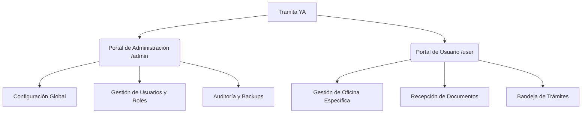
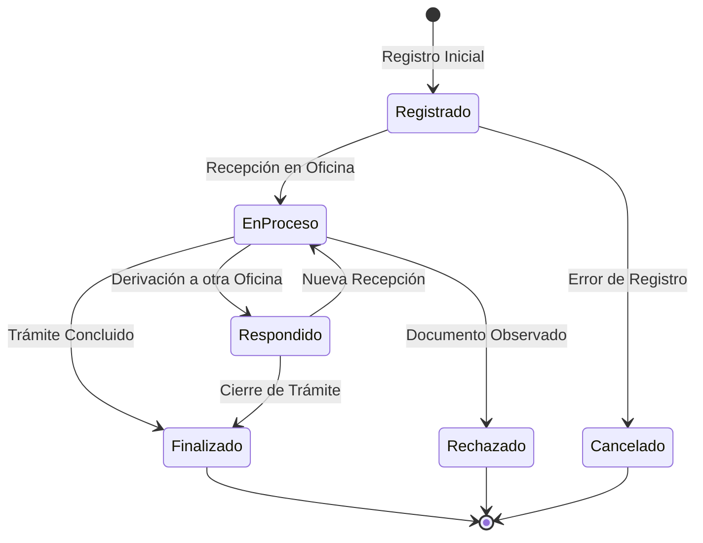
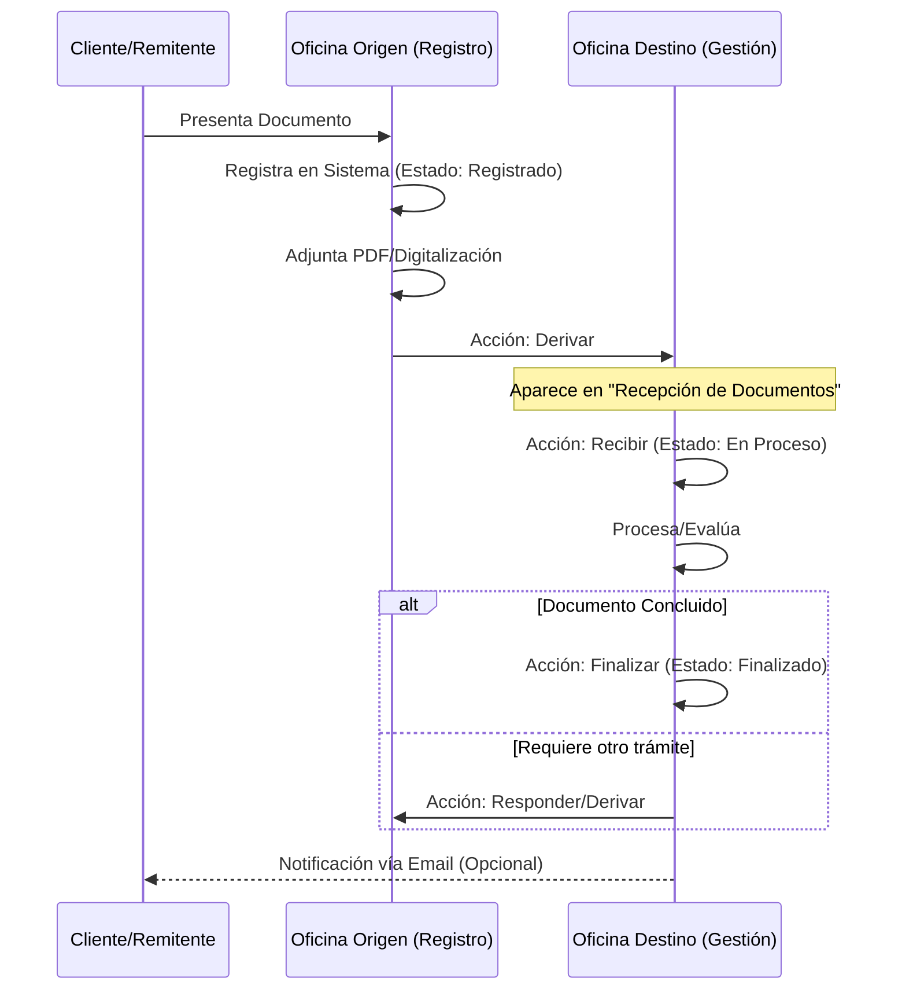

# Manual de Usuario - Sistema Tramita YA 🚀

## 1. Introducción
**Tramita YA** es un ecosistema digital de gestión y seguimiento documentario diseñado para optimizar el flujo de expedientes en entornos institucionales. Utiliza una arquitectura basada en **Laravel 12** y **Filament v5**, garantizando seguridad, trazabilidad total (auditoría) y una interfaz intuitiva para el usuario.

---

## 2. Arquitectura del Sistema

El sistema opera bajo un modelo de **dos portales especializados**:

---

## 3. Estados y Ciclo de Vida del Documento

Un documento atraviesa distintos estados representados por colores y iconos específicos. La transición entre estos estados es controlada y auditable.

### 3.1. Máquina de Estados (Diagrama de Flujo)

### 3.2. Definición de Estados
*   **⚪ Registrado:** El documento ha sido creado pero no ha sido recibido físicamente por la oficina de destino.
*   **🔵 En Proceso:** La oficina de destino ha confirmado la recepción. El documento está bajo su responsabilidad.
*   **🟣 Respondido:** Se ha emitido una respuesta o derivación adicional.
*   **🟢 Finalizado:** El trámite ha concluido exitosamente.
*   **🔴 Rechazado:** El documento no cumple con los requisitos o fue devuelto.
*   **🟡 Cancelado:** Registro anulado por error administrativo.

---

## 4. Roles y Permisos

El sistema utiliza **FilamentShield** para el control de accesos:

1.  **Super Administrador:** Acceso total, gestión de base de datos, auditoría y seguridad.
2.  **Administrador:** Gestión de catálogos (Oficinas, Tipos de Documentos, Clientes).
3.  **Jefe de Oficina / Operador:** Gestión operativa de documentos dentro de su unidad orgánica asignada.

---

## 5. Guía Detallada de Módulos

### 5.1. Panel de Usuario (`/user`) - Operatividad Diaria

Este panel es el motor del sistema. El personal solo gestiona los documentos de su oficina asignada.

#### A. Módulo: Recepción de Documentos (Buzón de Entrada)
Es el primer punto de contacto. Aquí aparecen los documentos que han sido "Derivados" a su oficina.
*   **Acciones:**
    *   **Recibir (Icono Inbox):** Cambia el estado a `En Proceso`. Es el paso obligatorio para iniciar el trabajo.
    *   **Responder (Icono Rocket):** Permite derivar a otra oficina o responder directamente.
    *   **Finalizar/Rechazar:** Cierra el flujo del documento indicando el motivo.
    *   **Documentos (PDF):** Visualización instantánea de los anexos digitales.

#### B. Módulo: Documentos (Bandeja Principal)
Contiene la lista de documentos que ya están bajo custodia de la oficina.
*   **Acciones:**
    *   **Nuevo Documento:** Registro de documentos que inician trámite en su oficina.
    *   **Derivar:** Envío a otra oficina seleccionando el destino y la acción (Derivado/Respondido).
    *   **Enviar Email:** Notifica al cliente/remitente sobre el estado actual.
    *   **Adjuntar Archivos:** Carga de sustentos PDF/Imágenes mediante el componente "Documentos".

---

### 5.2. Panel de Administración (`/admin`) - Configuración y Supervisión

#### A. Estructura Organizacional
*   **Oficinas:** Registro de sedes, unidades orgánicas y su estado (Activo/Inactivo).
*   **Gestiones (Administraciones):** Segmentación por periodos anuales o de gobierno.
*   **Tipos de Documentos:** Define la naturaleza del documento y sus plazos legales de atención.

#### B. Seguridad y Monitoreo
*   **Auditoría:** Registro de "Quién", "Cuándo" y "Qué" se modificó en cualquier registro.
*   **Backups:** Generación manual y programada de copias de seguridad de la base de datos y archivos.
*   **Escudo de Permisos:** Interfaz gráfica para asignar qué puede hacer cada rol (ver, crear, editar, borrar).

---

## 6. Flujo de Trabajo Detallado (Workflow)

El siguiente diagrama detalla la interacción entre el Cliente, la Oficina de Origen y la Oficina de Destino:

---

## 7. Preguntas Frecuentes (FAQ)

**1. ¿Por qué no puedo editar un documento que ya derivé?**
Por seguridad y trazabilidad, una vez que el documento sale de su oficina (Estado: Derivado), la edición se bloquea. Si hubo un error, debe coordinar con la oficina de destino para que lo devuelva o con el Administrador.

**2. ¿Qué significa el icono de "Rocket" (Cohete)?**
Es la acción de **Derivar/Responder**. Se utiliza para mover el expediente a la siguiente oficina en el flujo administrativo.

**3. ¿Cómo sé si un documento tiene archivos adjuntos?**
En las tablas de documentos, verá un botón rojo con icono de PDF. Si está habilitado, puede hacer clic para ver todos los archivos cargados.

**4. ¿El sistema funciona sin internet?**
El sistema está diseñado para entornos Web. Puede funcionar en una Intranet local (sin internet) si se instala en un servidor interno de la institución.
